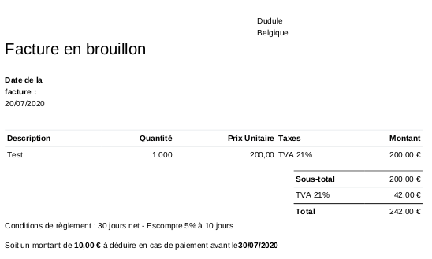

# ML Cash Discount

Adds Cash Discount on Invoices according to Belgian Tax Rules.

This module has been developped and tested on __Odoo 12__.

## Configuration

### Account

Select an account in the field __Outgoing Invoice Cash Discount Account__.

This will link the __Journal Items__ holding the cash discount
values to the selected account.

### Payment Terms

## Make an invoice

* Select the date of invoice
* Select the __Payment Term__ that you just created
* This calculates the __Due Date__ of the invoice

* The amount of the discount, and its validity date, are
calculated and displayed at the bottom of the invoice.

### Printed invoice

The amount of discount and its validity are printed on
the invoice.

## Payment

When registering a payment, selecting the date of payment
leads to a decision wether the discount is applied of not.

All the relevant information are displayed on the header.
If the date of payment is within the discount validity, the
amount of payment is automatically updated.

If not, the total amount of the invoice is used.

